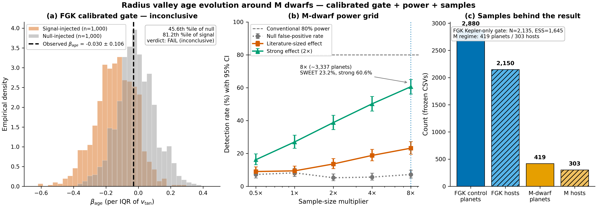
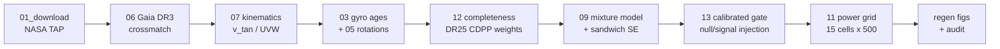

# 🪐 The Radius Valley's Age Evolution Around M Dwarfs


-999999)

**An inconclusive verdict — and a quantified path forward.** A calibrated
null/signal-injected gate asks whether today's archives can tell a
literature-sized age-evolution effect apart from no effect in radius-valley
demographics around M dwarfs. Answer: **not yet** — and here is exactly what
it will take.



> Figure: (a) FGK control gate — observed β<sub>age</sub> sits at the 45.6th
> percentile of the null and 81.2th of the signal (both admissible, verdict
> FAIL). (b) M-dwarf power grid with Clopper–Pearson 95% CIs — 8× inventory
> still only 23.2% SWEET detection. (c) Frozen samples behind the result.
> Regenerate with `python figures/make_overview.py`. Alt text: three-panel
> summary described above; data in `results/highrep/` + `data/`.

## ✨ Why this repo stands out

- 🔒 **Frozen + checksummed data** — every number reproduces offline (`sha256sum -c data/checksums.sha256`)
- 🧪 **Calibrated gate, not a single fit** — 2,000 high-replicate injections (1,000 null + 1,000 signal)
- 📊 **7,500-replicate power grid** — 15 cells × 500, with 95% CIs on every point
- 🔍 **Independent audit** — `results/colab_audit/AUDIT_REPORT.md` + re-runnable `code/audit_highrep.py`
- 📝 **Submission-ready manuscript** — AASTeX v7.01 source in `manuscript/`
- 🖼️ **Publication figures + hero overview** — `figures/` (all regenerable from raw CSVs)

## 🎯 Headline results (authoritative high-replicate run)

| Quantity | Value |
|---|---|
| Real β<sub>age</sub>/IQR (FGK control) | −0.0296 ± 0.1061 |
| Null median / 95% envelope (n=1,000) | −0.0186 / [−0.2476, +0.2246] |
| Real percentile in null (95% CI) | 45.6% [42.5, 48.7] · P(null ≥ real) = 0.544 |
| Signal median / 95% envelope (n=1,000) | −0.1365 / [−0.3898, +0.0836] |
| Real percentile in signal | 81.2% [78.6, 83.6] |
| **Gate verdict** | **FAIL (inconclusive)** — both hypotheses survive |
| 8× SWEET detection (n=500) | 23.2% [19.6, 27.2] |
| 8× strong detection (n=500) | 60.6% [56.2, 64.9] |
| Pooled null FPR / coverage | 6.68% / 91.3% (analytical intervals mildly anti-conservative; gate unaffected) |
| 80%-power scale (model-dependent) | ~1.7×10⁴ planets [1.4, 2.2]×10⁴ — a guide, not a requirement |

A wrong-sign binned age signal is a **period-mixing artifact**: old (high-`v_tan`)
hosts sit at longer periods where sub-Neptunes dominate.

## 🗺️ Pipeline



Run order = number order in `code/`. All scripts run from repo root with
relative paths.

## 🚀 Quickstart

```bash
pip install -r requirements.txt
sha256sum -c data/checksums.sha256
python code/audit_highrep.py          # verify gate + power from raw CSVs
python figures/make_overview.py       # rebuild hero figure
python code/regen_manuscript_figs.py  # rebuild Fig 2 + Fig 4
```

Full step-by-step: [`docs/REPRODUCIBILITY.md`](docs/REPRODUCIBILITY.md) ·
Methods: [`docs/METHODS.md`](docs/METHODS.md) ·
Data dictionary: [`docs/DATA_DICTIONARY.md`](docs/DATA_DICTIONARY.md) ·
Colab high-rep run: [`colab/README.md`](colab/README.md)

## 📁 Repository layout

```
├── code/          numbered pipeline (01→15, B1/B2, appendix_* , audit_highrep)
├── data/          frozen CSVs + checksums.sha256 (offline-reproducible)
├── results/       pipeline outputs; results/highrep/ = authoritative raw replicates
├── figures/       fig1–fig4 + overview.png/pdf + make_overview.py
├── manuscript/    AASTeX source, .bib, revision log, compile instructions
├── colab/         high-replicate experiment (1,000/arm gate, 500/cell grid)
├── docs/          METHODS, REPRODUCIBILITY, DATA_DICTIONARY, USAGE_COLAB, notes
└── .github/workflows/ci.yml
```

## ⚠️ Caveats (disclosed in manuscript)

- Age is host-level; M-dwarf information is dominated by population-level `v_tan` (only 12/303 hosts yield gyro ages).
- Bootstrap grid re-uses ~301 M hosts — diversity saturates; σ ∝ N<sup>−1/2</sup> is a premise.
- M sample (T<sub>eff</sub> < 4200 K) spans late-K–late-M, not isolated M3+.
- Isochrone validation incomplete (`B1`/`B2`).

## 📚 Citation

See [`CITATION.cff`](CITATION.cff). If you use code, data, or results, cite the
manuscript (`manuscript/`) and this repository. Curated CSVs follow NASA
Exoplanet Archive / Gaia DR3 / Kepler DR25 access conditions (see `LICENSE`).

## 🛠️ Built with (skills)

- `scientific-visualization` + `matplotlib` — truthful, accessible figures
  (Okabe–Itō palette, redundant color+marker encoding, explicit uncertainty)
- `scientific-writing` — evidence-bound prose, no invented numbers
- `citation-management` — verifiable references (`manuscript/sample701.bib`)
- `astropy` — Gaia kinematics; `statsmodels`/`scipy` — sandwich SEs, CIs

> Kassis, T., et al. (2026). Scientific Agent Skills. arXiv:2609.00065.
> https://doi.org/10.48550/arXiv.2609.00065
